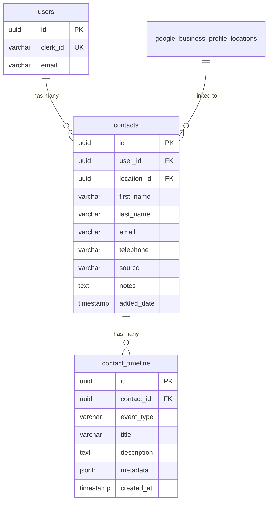

# Contact Manager Database Design

Database schema for contacts with timeline tracking.

---

## Entity Relationship Diagram



---

## Tables

### `contacts`

| Column      | Type         | Constraints             | Description                   |
| ----------- | ------------ | ----------------------- | ----------------------------- |
| id          | uuid         | PK                      | Unique identifier             |
| user_id     | uuid         | FK → users.id, NOT NULL | Owner                         |
| location_id | uuid         | FK → gbp_locations.id   | Linked business               |
| first_name  | varchar(255) | NOT NULL                |                               |
| last_name   | varchar(255) |                         |                               |
| email       | varchar(255) | NOT NULL                |                               |
| telephone   | varchar(50)  |                         |                               |
| source      | varchar(50)  | NOT NULL                | `manual` \| `import` \| `crm` |
| notes       | text         |                         | Free-form notes               |
| added_date  | timestamp    | NOT NULL                | When added                    |

---

### `contact_timeline`

| Column      | Type         | Constraints                | Description            |
| ----------- | ------------ | -------------------------- | ---------------------- |
| id          | uuid         | PK                         | Unique identifier      |
| contact_id  | uuid         | FK → contacts.id, NOT NULL | Parent contact         |
| event_type  | varchar(50)  | NOT NULL                   | Event code (see below) |
| title       | varchar(255) | NOT NULL                   | Display title          |
| description | text         |                            | Event details          |
| metadata    | jsonb        |                            | Additional data        |
| created_at  | timestamp    | NOT NULL                   | When occurred          |

**Event Types:**
| Type | Description |
|------|-------------|
| `added` | Contact created |
| `sms_sent` | Review request sent |
| `sms_delivered` | SMS delivered |
| `sms_failed` | Delivery failed |
| `link_clicked` | Review link opened |
| `review_completed` | Review submitted |
| `reminder_sent` | Follow-up sent |
| `unsubscribed` | Opted out |

---

## Drizzle Schema

```typescript
import {
  pgTable,
  uuid,
  varchar,
  timestamp,
  text,
  jsonb,
} from "drizzle-orm/pg-core";

export const contacts = pgTable("contacts", {
  id: uuid("id").primaryKey().defaultRandom(),
  userId: uuid("user_id")
    .references(() => users.id)
    .notNull(),
  locationId: uuid("location_id").references(
    () => googleBusinessProfileLocations.id
  ),
  firstName: varchar("first_name", { length: 255 }).notNull(),
  lastName: varchar("last_name", { length: 255 }),
  email: varchar("email", { length: 255 }).notNull(),
  telephone: varchar("telephone", { length: 50 }),
  source: varchar("source", { length: 50 }).default("manual").notNull(),
  notes: text("notes"),
  addedDate: timestamp("added_date").defaultNow().notNull(),
  createdBy: varchar("created_by", { length: 255 }),
  createdDate: timestamp("created_date").defaultNow(),
  modifiedBy: varchar("modified_by", { length: 255 }),
  modifiedDate: timestamp("modified_date"),
});

export const contactTimeline = pgTable("contact_timeline", {
  id: uuid("id").primaryKey().defaultRandom(),
  contactId: uuid("contact_id")
    .references(() => contacts.id)
    .notNull(),
  eventType: varchar("event_type", { length: 50 }).notNull(),
  title: varchar("title", { length: 255 }).notNull(),
  description: text("description"),
  metadata: jsonb("metadata"),
  createdAt: timestamp("created_at").defaultNow().notNull(),
});

// Types
export type Contact = typeof contacts.$inferSelect;
export type NewContact = typeof contacts.$inferInsert;
export type ContactTimelineEvent = typeof contactTimeline.$inferSelect;
```
