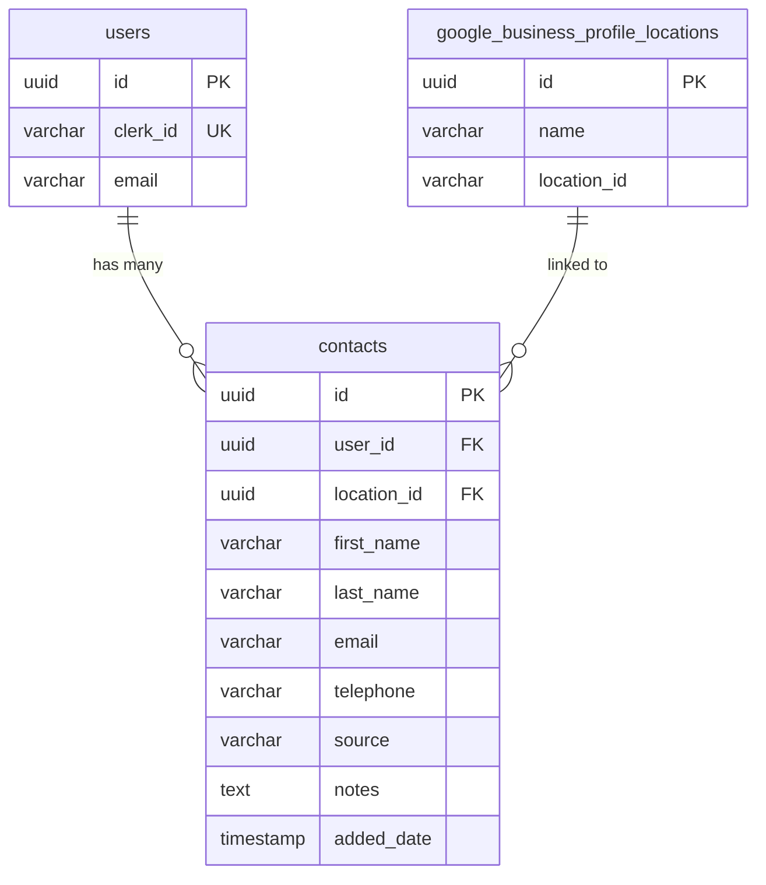

# Contact Manager Database Design

Focused schema for the contacts table.

---

## Entity Relationship Diagram



---

## Contacts Table

| Column        | Type         | Constraints                 | Description                   |
| ------------- | ------------ | --------------------------- | ----------------------------- |
| id            | uuid         | PK, default random          | Unique identifier             |
| user_id       | uuid         | FK → users.id, NOT NULL     | Owner of the contact          |
| location_id   | uuid         | FK → gbp_locations.id, NULL | Linked business location      |
| first_name    | varchar(255) | NOT NULL                    | First name                    |
| last_name     | varchar(255) | NULL                        | Last name                     |
| email         | varchar(255) | NOT NULL                    | Email address                 |
| telephone     | varchar(50)  | NULL                        | Phone number                  |
| source        | varchar(50)  | NOT NULL, default 'manual'  | 'manual' \| 'import' \| 'crm' |
| notes         | text         | NULL                        | Free-form notes about contact |
| added_date    | timestamp    | NOT NULL, default now()     | When contact was added        |
| created_by    | varchar(255) | NULL                        | Audit field                   |
| created_date  | timestamp    | default now()               | Audit field                   |
| modified_by   | varchar(255) | NULL                        | Audit field                   |
| modified_date | timestamp    | NULL                        | Audit field                   |

**Indexes:**

- `idx_contacts_user_id` on (user_id)
- `idx_contacts_user_email` on (user_id, email) UNIQUE

---

## Drizzle Schema

```typescript
import { pgTable, uuid, varchar, timestamp, text } from "drizzle-orm/pg-core";
import { users } from "./schema";
import { googleBusinessProfileLocations } from "./schema";

export const contacts = pgTable("contacts", {
  id: uuid("id").primaryKey().defaultRandom(),
  userId: uuid("user_id")
    .references(() => users.id)
    .notNull(),
  locationId: uuid("location_id").references(
    () => googleBusinessProfileLocations.id
  ),
  firstName: varchar("first_name", { length: 255 }).notNull(),
  lastName: varchar("last_name", { length: 255 }),
  email: varchar("email", { length: 255 }).notNull(),
  telephone: varchar("telephone", { length: 50 }),
  source: varchar("source", { length: 50 }).default("manual").notNull(),
  notes: text("notes"),
  addedDate: timestamp("added_date").defaultNow().notNull(),
  createdBy: varchar("created_by", { length: 255 }),
  createdDate: timestamp("created_date").defaultNow(),
  modifiedBy: varchar("modified_by", { length: 255 }),
  modifiedDate: timestamp("modified_date"),
});

// Type exports
export type Contact = typeof contacts.$inferSelect;
export type NewContact = typeof contacts.$inferInsert;
```

---

## Source Values

| Value    | Description                 |
| -------- | --------------------------- |
| `manual` | Added individually via UI   |
| `import` | Bulk imported from CSV      |
| `crm`    | Synced from CRM integration |
